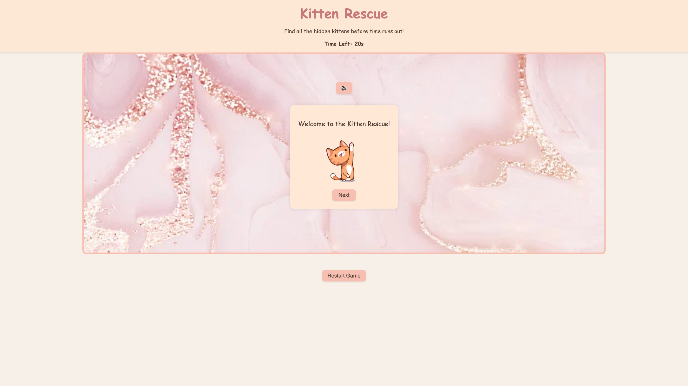

## Kitten Rescue

**1. Game Name**  
Kitten Rescue! 

**2. Description**  
"Kitten Rescue!" is a fun and fast-paced memory game where players must find five hidden kittens on a 5x5 grid before time runs out. Each tile can hide a kitten, a mischievous dog, or simply be empty. The challenge intensifies when a dog is revealed, as all previously found kittens hide again, testing the player's memory under pressure!

The game features an engaging introduction sequence that guides the player through the rules, a dynamic timer, and celebratory confetti upon successfully rescuing all the kittens.

**3. User Story**  
- As a casual game player, I want to quickly understand the game rules and jump right into playing and have fun.  
- As a player who loves a challenge, I want a clear objective and a time limit, to feel the pressure and find all the kittens quickly.
- As a player, I want clear visual and audio feedback for winning and losing, so I know the outcome of my game and can celebrate or try again.
- As a player, I want the game to react dynamically when I hit the dog, so the game remains engaging and I have to adapt my strategy.
- As a player, I want to be able to restart the game easily at any point, and quickly jump into a new round if I want to improve my score or just play again.
- As a player, I want to be able to control the audio switching it to on/off anytime.


**4. Background & Motivation**  
This project was developed as a hands-on exercise in software engineering, providing a practical application of fundamental web development concepts. As a first major project, the goal was to build a complete, interactive game from scratch, focusing on core JavaScript logic, DOM manipulation, event handling, and state management. The "Kitten Rescue!" theme was chosen for its simplicity, visual appeal, and the opportunity to implement engaging mechanics like a timer, hidden elements, and dynamic game resets. It serves as a foundational learning experience in bringing a creative idea to life through code.

**4. How to Play**  
**Start the Game:** Click the ```"Next"``` button through the introduction sequence until the "Start Game" button appears.

**Click Tiles:** The game board is a 5x5 grid. Click on any tile to reveal what's underneath.

**Find Kittens:** Your goal is to find all 5 hidden kittens. When you click a tile with a kitten, it stays revealed, and your "found kittens" count increases.

**Beware the Dog!** If you click a tile with a dog, all previously found kittens will hide again! You'll need to remember their locations as the timer continues to run.

**Time Limit:** You have 20 seconds to find all 5 kittens. Keep an eye on the timer!

**Win Condition:** Find all 5 kittens before the timer reaches 0. Upon finding the last kitten, the timer stops, and a confetti animation celebrates your victory!

**Lose Condition:** If the timer runs out before you find all 5 kittens, the game ends.

**Restart:** Click the ```"Restart"``` button at any time to begin a new game.

**Level-up:** tbd

**5. Features**  
*Interactive 5x5 Grid:* Clickable tiles for revealing hidden elements.

*Hidden Kittens & Dog:* Random placement of 5 kittens and 1 dog.

*Dynamic Timer:* Counts down from 20 seconds, adding urgency to the gameplay.

*Dog Mechanic:* Clicking the dog re-hides all found kittens, adding a memory challenge.

*Music Toggle:* Background music that can be turned on/off by the player.

*Sound Effects:* Ssounds when the dog is clicked, and a "time's up" sound for losing and sound for winning.

*Win Celebration:* Confetti animation and timer stop upon successfully finding all kittens.

*Intuitive Intro Sequence:* Guides new players through the game's rules.

*Restart Functionality:* Allows players to quickly start a new game at any point.

**6. Technologies & Resources Used**  
**HTML5:** For structuring the game's user interface and content.

**CSS3:** For styling the game board, buttons, images, and providing responsive design.

**JavaScript:** The core programming language for game logic, interactivity, DOM manipulation, and state management.

**7. Assets & Libraries**  

**canvas-confetti Library:** Used for the celebratory confetti animation upon winning.
[CDN Link](https://cdn.jsdelivr.net/npm/canvas-confetti@1.9.3/dist/confetti.browser.min.js)

**Sound Assets:**

Background Music: ../resourses/Music/bg_music.mp3 (or similar)   
Dog Bark Sound: ../resourses/Music/bark.mp3 (or similar)  
Time's Up Sound: ../resourses/Music/timesup.mp3  

**Image Assets (GIFs):**  

./resourses/Img/kitten.gif (for intro) 
./resourses/Img/dancingkitten.gif (for instructions)  
./resourses/Img/warning_dog.gif (for dog warning)  
Emojis: 🐱 (kitten), 🐶 (dog) for tile content.

**9. Future Enhancements**   

tbd